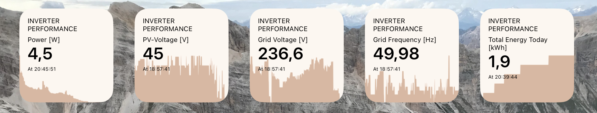

# thingspeak-ios-widget
iOS widgets using Scriptable to display data from ThingSpeak channels 

For original JavaSript file click [here](https://gist.github.com/anilkpatro/0b3efd3b7ea3e653ccb6487c33f140ce).

Import this JS-file into Scriptable on your iOS/iPadOS device, you will be able to create nice Widgets from your ThingSpeak channel-data.
Example usecase: Display current inverter performance of your pv power plant. More info about reading inverter performance in this [example](https://github.com/Fbisinger/growattlogger)

